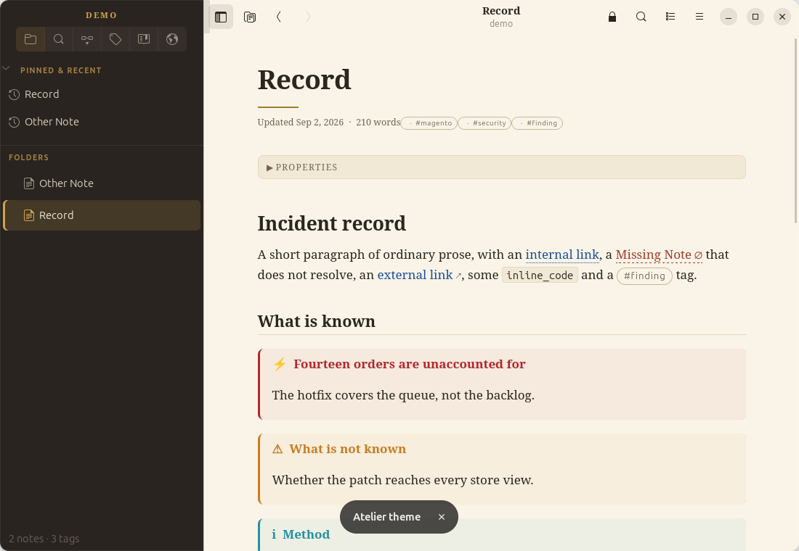
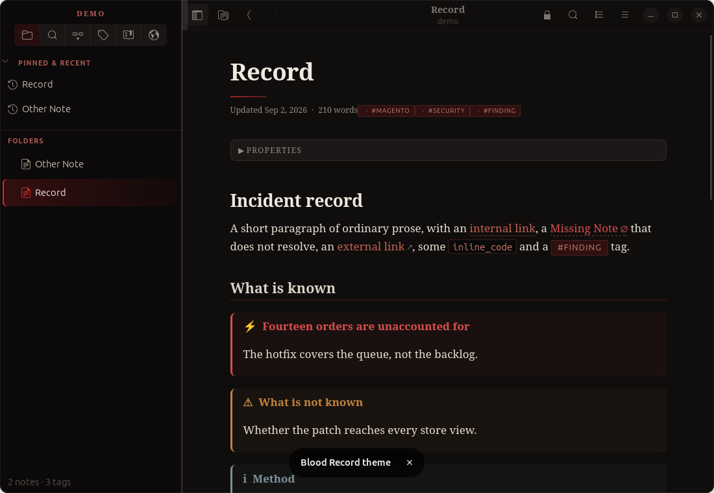
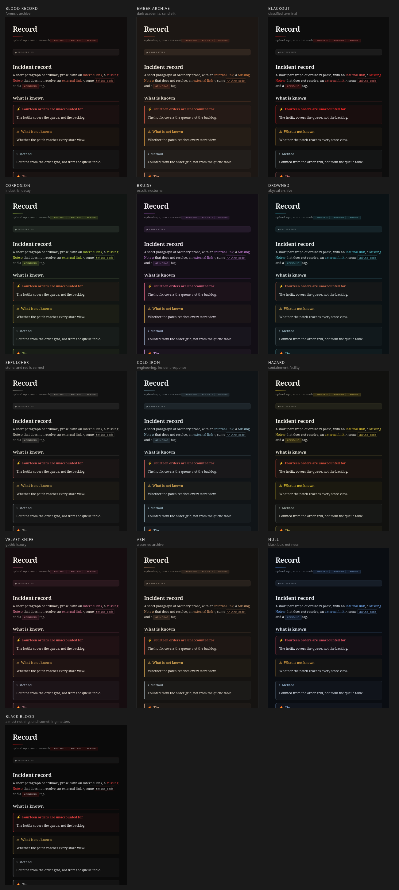

# Solander

[](https://github.com/kingletas/solander/actions/workflows/ci.yml)
[](LICENSE)

A reading application for Ubuntu that opens a folder of Markdown **in place** and never writes into it — no caches, no plugins, no scripts, no network. It is fluent in [Obsidian](https://obsidian.md)'s dialect: wikilinks, embeds, callouts, frontmatter, tags, canvases, kanban boards, `.base` views and Dataview queries all render as themselves.

A solander is the clamshell box an archive keeps its documents in. That is the job: present the record, and leave it exactly as it was found — whether Obsidian is closed, not installed, or simply not something you want pointed at a vault you only mean to inspect.

> This project is not affiliated with or endorsed by Obsidian.md / Dynalist Inc. "Obsidian" here names the vault format the reader understands.



## The name

A **solander** is the clamshell box an archive keeps its documents in — a hinged case, made to the size of what it holds, that you open to look at a thing and close to leave it as it was. Named for Daniel Solander, the botanist who devised it for Joseph Banks's specimens so they could be examined without being handled.

That is the whole design brief of this application, in one object. It presents the record and changes nothing: it never writes into your vault, never runs anything the vault contains, and never opens a network connection. A reader, not an editor — a case, not a workshop.

It is also deliberately **not** named after the format it reads. The app understands Obsidian's dialect fluently, but that is a property of the reader rather than its identity, and borrowing another project's name for your own is a bad habit whichever way the trademark points.

## What it does

The full walkthrough is the **[user guide](docs/user-guide.md)**; installation is **[getting started](docs/getting-started.md)**. In summary:

- **Renders the whole vault, not just the markdown.** CommonMark/GFM plus the Obsidian layer — wikilinks with Obsidian's own resolution order, embeds, callouts, highlights, comments, tags, footnotes, frontmatter properties, syntax-highlighted code — and TeX math as native MathML, `.canvas` pages, kanban boards as boards, Excalidraw drawings as SVG, `.base` table views, and **Dataview queries and inline expressions evaluated in pure Python**, live against the index. Anything unsupported degrades to labeled source with the reason.
- **Finds things like a launcher.** Fuzzy quick-open, relevance-ranked full-text search with `path:`/`file:`/`tag:` operators and highlighted hits, backlinks with context, a tag browser, the vault's bookmarks, a local graph, and hover previews.
- **Stays current and starts warm.** The vault is watched — outside edits appear in seconds — and the index persists per vault, so a 10,000-note vault opens in about a second after its first build.
- **Reads comfortably.** Fourteen themes — **Atelier**, a warm manuscript palette with serif display type, and the thirteen dark themes of the **Archive** family, from *Blood Record* to *Cold Iron* — and each note opens with a breadcrumb, title, and metadata line, linked mentions follow the content, and the outline is a real panel with a visible toggle (`F8`). Tabs, a mind-map view of any note, reading (zen) mode, typography controls, pinned notes, the vault's own CSS snippets (sanitized), folder hiding, and PDF export through a proper print stylesheet — plus an in-app PDF viewer when Poppler's bindings are present.

## What it will never do

- **Write into the vault.** No caches, indexes, locks, conflict files, or thumbnails. All application state lives under `~/.config/solander/` and `~/.cache/solander/`.
- **Execute anything from a note.** JavaScript is disabled in the rendering surface; raw HTML in notes is escaped, and the generated HTML passes through an allowlist sanitizer before display. Templater and `dataviewjs` render as labeled inert source.
- **Touch the network.** Remote images, scripts, stylesheets, and fonts are blocked; `http`/`https` links open in your system browser, and every other URI scheme is refused.

## Install

### Flatpak

The simplest route, and the only one with **no sandbox step at all** — Flatpak's own bubblewrap already has the permission WebKit needs, so nothing has to be installed into `/etc`.

The bundle is 3 MB and does not contain the GNOME 50 runtime it runs on, so a remote that provides it has to be configured. If you have ever installed anything from Flathub, it already is:

```bash
flatpak remote-add --if-not-exists --user flathub https://dl.flathub.org/repo/flathub.flatpakrepo
```

Then take the bundle from the [latest release](https://github.com/kingletas/solander/releases/latest):

```bash
flatpak install --user solander_2.2.1.flatpak
```

The first install also pulls the runtime — about a gigabyte, once, shared with every other Flatpak. A Flatpak install puts no `solander` on your `PATH`; `flatpak run com.kingletas.Solander` is the terminal equivalent.

### Debian package

For Ubuntu 24.04+. It pulls the GObject bindings itself and installs the AppArmor profile, so there is nothing to do afterwards:

```bash
sudo apt install ./solander_2.2.1_all.deb
```

### From source

Requires Ubuntu 24.04+ (GTK 4, libadwaita 1.5+, WebKitGTK 6.0) with the system GObject bindings:

```bash
sudo apt install python3-gi gir1.2-gtk-4.0 gir1.2-adw-1 gir1.2-webkit-6.0
```

Optional, for the embedded PDF preview (PDFs open externally without it):

```bash
sudo apt install gir1.2-poppler-0.18
```

Then, with [uv](https://docs.astral.sh/uv/) installed:

```bash
make install
```

That creates the virtualenv against the system Python (so the GI bindings are visible), installs the dependencies, and puts a `solander` launcher on your `PATH`. `make help` lists everything else. A source install needs the one-time [sandbox step](#the-sandbox-and-ubuntus-user-namespace-policy) below; the Flatpak and the deb do not.

## Run

Launch **Solander** from your applications grid — it restores your last session, and the welcome page opens a vault from there. Markdown files and folders also offer it under *Open With* in your file manager. On a stock Ubuntu the very first launch shows a **one-time setup window** (the sandbox step below) with a single copy-paste command; after that it just opens.

The terminal works too:

```bash
solander ~/path/to/vault      # open a folder as a vault
solander note.md              # open a single note
solander                      # reopen the last session
```

A second launch hands its path to the running instance instead of racing it for state.

## Documentation

- **[Getting started](docs/getting-started.md)** — install, the one-time sandbox step, first vault.
- **[User guide](docs/user-guide.md)** — every feature, the Dataview surface, shortcuts, configuration, troubleshooting.
- **[SECURITY.md](SECURITY.md)** — the threat model and reporting route.
- **[CHANGELOG.md](CHANGELOG.md)** — release history.
- **[CONTRIBUTING.md](CONTRIBUTING.md)** — how to build, test and send a change.

## Themes

Fourteen, and the theme is remembered. **Atelier** is the default — parchment and sepia ink by day, a candlelit nocturne by night. The **Archive** family is thirteen dark themes over one design language: a dark ground, bone text, an accent for what is important, and one hot colour held back for what actually matters. The semantics hold across all of them, so danger, warning, verified and information mean the same thing in every one, and every colour that carries text is checked against WCAG AA on the ground it sits on.



All thirteen, on the same note:



## The sandbox and Ubuntu's user-namespace policy

WebKitGTK wraps its rendering processes in a bubblewrap sandbox, and that sandbox needs to create an unprivileged user namespace. Ubuntu 24.04+ restricts those by default (`kernel.apparmor_restrict_unprivileged_userns=1`), so on a stock system the app would abort with `bwrap: setting up uid map: Permission denied`. The launcher detects this before WebKit crashes: **started from the desktop, it opens a setup window with a single copy-paste command and a “check again” button that relaunches the app once the profile is in**; started from a terminal with no display, it prints the same fix.

The fix is a one-time AppArmor profile granting the permission to this app's interpreter alone — `make install` gives the venv a private interpreter copy, so the profile names a path nothing else uses. `--sandbox` prints that profile and nothing else, so it pipes:

```bash
solander --sandbox | sudo tee /etc/apparmor.d/solander
```

```bash
sudo apparmor_parser -r /etc/apparmor.d/solander
```

```bash
solander --sandbox-status
```

The last one reports whether the profile is installed, whether it attached to this interpreter, and whether the sandbox actually starts — it exits non-zero while anything is still wrong. Then start the app again. This is the same mechanism Ubuntu itself ships for browsers: the profile is `flags=(unconfined)` — it confines nothing — plus a single `userns,` grant, and it keeps WebKit's sandbox *on*, which is strictly better than the workaround of disabling user-namespace restrictions system-wide.

One subtlety the launcher handles for you: AppArmor attaches the profile by interpreter path, and a `#!` shebang launch (such as running the venv's console script directly) bypasses attachment. The `solander` launcher execs the interpreter directly for exactly this reason — start the app through it.

## Development

```bash
make check    # ruff + the test suite — everything a commit has to pass
make test     # test suite only
make run      # run from the working tree
```

The core (vault model, link resolution, Markdown transforms, sanitizer, search) is pure Python with no GTK dependency, and the test suite covers it directly — including a zero-write test that hashes a fixture vault before and after a full index-and-render pass. The GTK/WebKit layer stays thin and is exercised by running the app.

## Security model

The vault is treated as attacker-controlled input. The trust boundary is the sanitizer: everything upstream of it (parsing, transforms, link resolution) handles untrusted text, and nothing downstream receives unsanitized markup. On top of that, the WebKit surface runs with JavaScript disabled (and refuses to start if it cannot be), vault assets are served through a `vault:` URI scheme handler that refuses any path resolving outside the vault root, and the navigation policy blocks every load that is not an internal page, a vault asset, or a user-initiated external link. Resource use is bounded too: note size, frontmatter size, embed depth, and embeds per page are capped, and YAML aliases in frontmatter are refused — each bound proven against a payload that previously froze the renderer. See [SECURITY.md](SECURITY.md) for the model and the reporting route.

## License

MIT — see [LICENSE](LICENSE).
